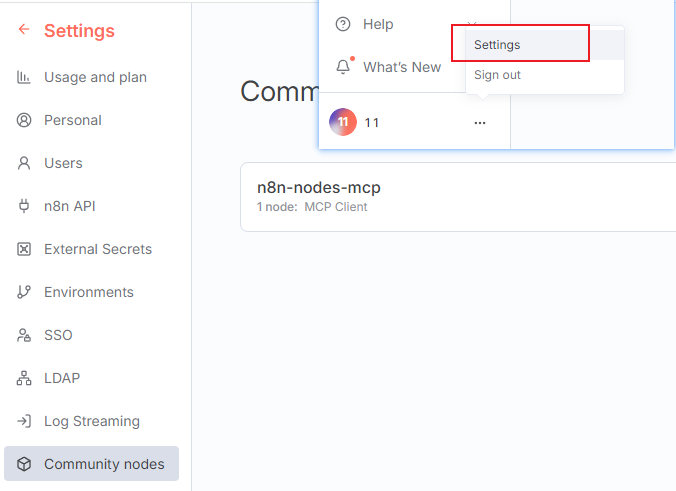

## 环境要求 
1. node

## 项目启动

### 前端项目启动
1. 进入根目录安装依赖`pnpm install`
2. 启动项目`pnpm dev --host=0.0.0.0`

### 工作流启动
1. 本地安装n8n并启动项目, 管理员身份运行powershell
   ```powershell
    $env:N8N_HOST = "0.0.0.0"
    $env:N8N_PORT = "5678"
    $env:N8N_EDITOR_BASE_URL = "http://192.168.104.57:5678"
    $env:N8N_SECURE_COOKIE = "false"
    npx n8n
   ```
2. 安装MCP社区节点
3. 进入n8n_agent文件夹, `main.json`为工作流文件, 导入到n8n当中
4. 激活工作流即可

---

**安装MCP社区节点截图**



**导入、激活工作流截图**


## 使用

拖拽文件到输入框等待分析结果