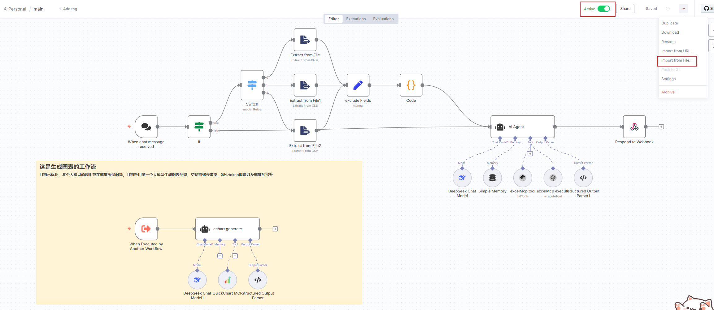

## 环境要求 
1. docker (n8n镜像)
2. node

## 项目启动

### 前端项目启动
1. 进入根目录安装依赖`pnpm install`
2. 启动项目`pnpm dev`

### 工作流启动
1. 进入n8n_agent文件夹, `main.json`为工作流文件, 导入到n8n当中
2. 激活工作流即可
3. 本地执行docker命令`docker compose up -d`, 启动工作流

**截图**

## 使用

拖拽文件到输入框等待分析结果